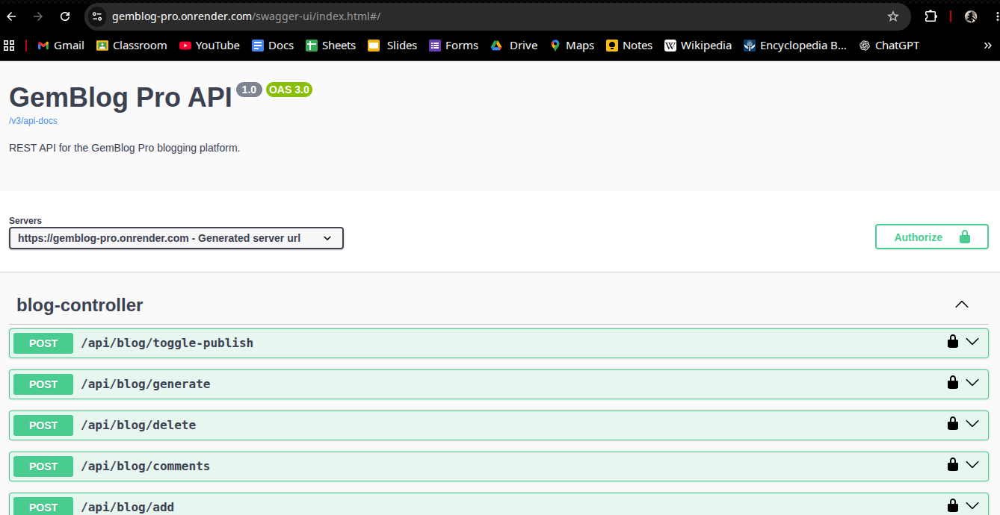
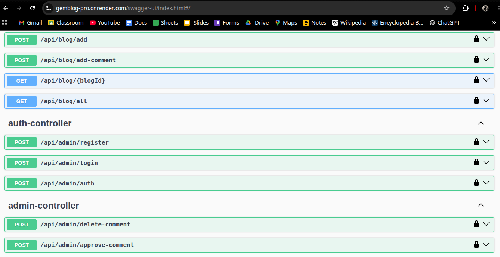
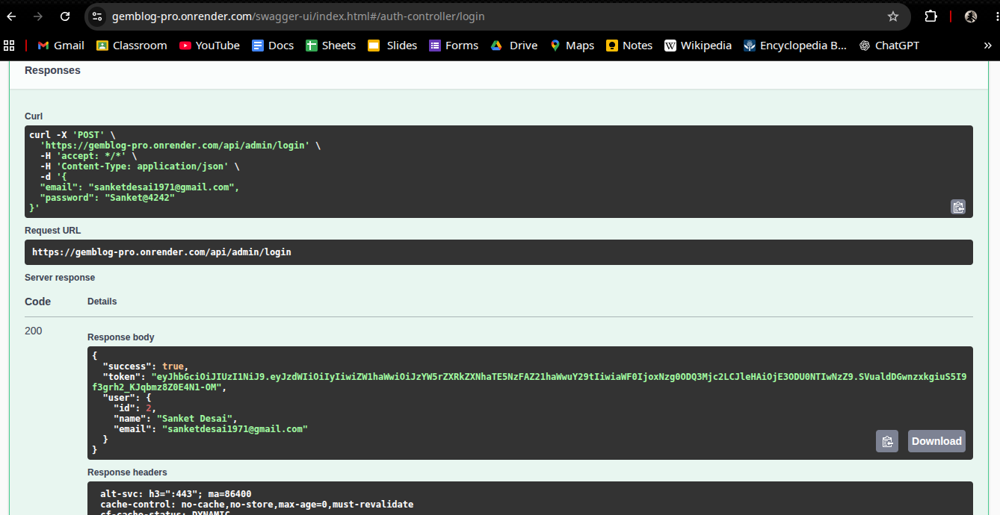
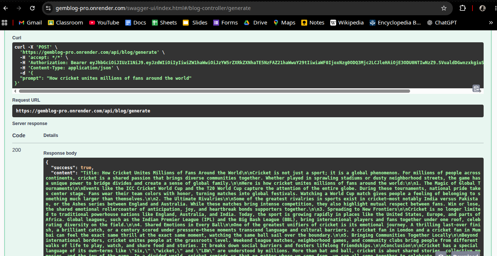

# GemBlog Pro

A production-ready backend REST API for a blogging platform built with Spring Boot. It provides secure JWT authentication, blog management, AI-assisted content generation, image uploads, comment moderation, and an admin dashboard.

---

## Features

- JWT-based authentication and authorization
- Create, update, publish, update, and delete blogs
- AI-assisted blog content generation using Google Gemini
- Image upload integration with ImageKit
- Blog commenting system with admin moderation
- Admin dashboard with analytics
- Global exception handling
- Request validation
- OpenAPI 3 / Swagger documentation
- Spring Boot Actuator
- Docker support
- Unit and integration testing

---

# Tech Stack

| Category | Technology |
|-----------|------------|
| Language | Java 21 |
| Framework | Spring Boot 3.3.4 |
| Security | Spring Security + JWT |
| ORM | Spring Data JPA (Hibernate) |
| Database | MySQL 8 |
| Build Tool | Maven |
| Documentation | Swagger / OpenAPI |
| Connection Pool | HikariCP |
| AI | Google Gemini API |
| Image Storage | ImageKit |
| Testing | JUnit 5, Mockito |
| Deployment | Docker |

---

# System Architecture

```
                   Client
                      │
                      ▼
               Spring Security
             (JWT Authentication)
                      │
                      ▼
                 REST Controllers
                      │
        ┌─────────────┴─────────────┐
        ▼                           ▼
  Service Layer              AI/Image Services
        │                    Gemini / ImageKit
        ▼
 Repository Layer
        │
        ▼
      MySQL
```

---

# Project Structure

```text
src/main/java/com/gemblogpro
├── config
├── controller
├── dto
├── entity
├── exception
├── repository
├── security
├── service
└── util
```

---

# Prerequisites

- Java 21
- Maven
- MySQL 8+

---

# Installation

```bash
git clone https://github.com/sanketInTech/GemBlog-Pro.git

cd GemBlog-Pro
```

---

# Environment Variables

Create a `.env` file.

```env
DB_URL=
DB_USERNAME=
DB_PASSWORD=

JWT_SECRET=

IMAGEKIT_PUBLIC_KEY=
IMAGEKIT_PRIVATE_KEY=
IMAGEKIT_URL_ENDPOINT=

GEMINI_API_KEY=
```

---

# Running the Project

```bash
mvn spring-boot:run
```

or

```bash
mvn clean install

java -jar target/gemblog-pro.jar
```

Application:

```
https://gemblog-pro.onrender.com
```

---

# API Documentation (Swagger)

Interactive API documentation is available after starting the application.

### Swagger UI

```
https://gemblog-pro.onrender.com/swagger-ui/index.html#/
```

### OpenAPI Specification

```
https://gemblog-pro.onrender.com/v3/api-docs
```

Swagger provides:

- Interactive API testing
- JWT Authentication support
- Request & Response schemas
- Endpoint documentation

---

# Authentication

Login endpoint:

```
POST /api/admin/login
```

Copy the returned JWT token.

Click **Authorize** inside Swagger and enter:

```
Bearer <your-token>
```

---

# REST API Modules

### Authentication

- Register Admin
- Login
- Verify Authentication

### Blog

- Create Blog
- Update Blog
- Delete Blog
- Publish / Unpublish Blog
- Get Blog
- Get All Blogs

### AI

- Generate Blog using Google Gemini

### Comments

- Add Comment
- Approve Comment
- Delete Comment

### Dashboard

- Dashboard Statistics

---

# Database

Uses **MySQL** with Hibernate (`ddl-auto=update`).

Main entities:

```
Admin
Blog
Comment
```

Relationships

```
Admin
   │
   │ 1:N
   ▼
 Blog
   │
   │ 1:N
   ▼
Comment
```

---

## AI Blog Generation Flow

```text
User Login
    │
    ▼
Receive JWT Token
    │
    ▼
Authorize in Swagger (Bearer Token)
    │
    ▼
POST /api/blog/generate
    │
    ▼
Spring Boot Backend
    │
    ▼
Gemini API
    │
    ▼
AI-Generated Blog Content
    │
    ▼
JSON Response Returned
```
---

# Security

- JWT Authentication
- Stateless Sessions
- Password Encryption (BCrypt)
- Protected Admin APIs
- Public Blog APIs

---

# Health Endpoint

Spring Boot Actuator

```
GET /actuator/health
```

---

# Testing

Run all tests

```bash
mvn clean test
```

---

# Docker

Build image

```bash
docker build -t gemblog-pro .
```

Run container

```bash
docker run -p 8080:8080 --env-file .env gemblog-pro
```

---

# Screenshots

## Swagger UI



## API Endpoints



## Authentication



## AI Blog Generation


---

# License

This project is intended for learning, portfolio, and educational purposes.