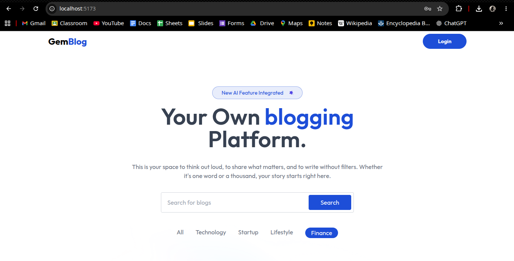
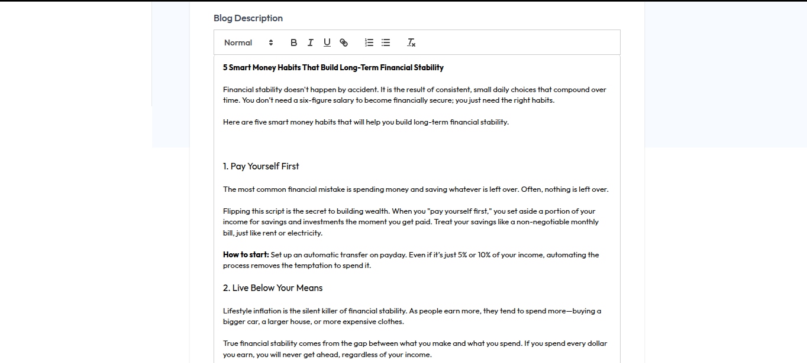
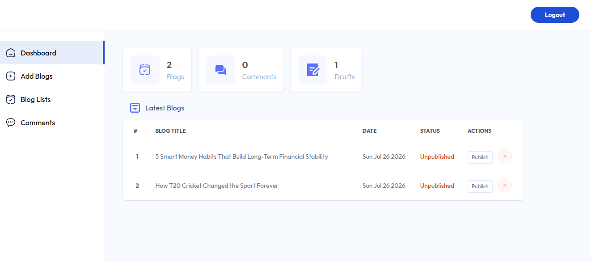
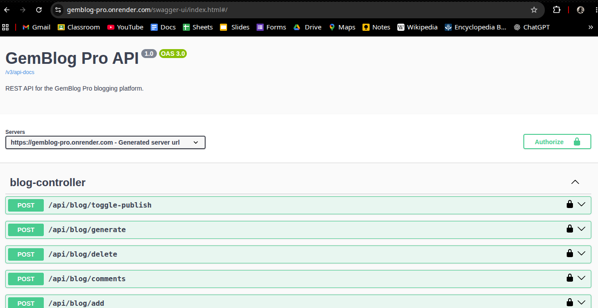
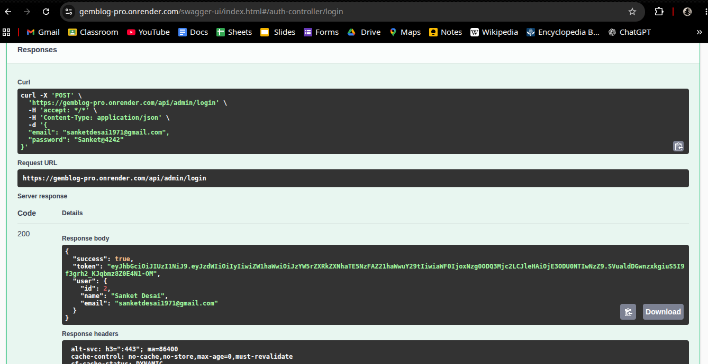

# GemBlog Pro

GemBlog Pro is a full-stack AI-powered blogging platform built with Spring Boot and React. It allows administrators to create, manage, and publish blogs while using Google Gemini AI to generate content. The application also includes secure authentication, image uploads, comment moderation, and an admin dashboard for managing the platform.

---

## Preview

### Home Page



### Blog Page



### Admin Dashboard



## Features

### Authentication & Security

- JWT-based authentication
- Secure admin login
- Password encryption using BCrypt
- Protected admin APIs with Spring Security
- Stateless authentication

### Blog Management

- Create, edit, publish, and delete blogs
- Rich blog management dashboard
- Upload cover images
- View published blogs
- Responsive blog pages

### AI Content Generation

- Generate complete blog drafts using Google Gemini AI
- AI-generated content can be edited before publishing
- Fast content generation workflow

### Comments

- Visitors can leave comments on blogs
- Admin approval system for comments
- Delete inappropriate comments

### Admin Dashboard

- Blog statistics
- Comment moderation
- Manage published and draft blogs
- Quick access to blog management features

### User Experience

- Clean and responsive React UI
- Modern dashboard design
- Mobile-friendly layout
- Smooth navigation

### Developer Features

- RESTful API
- Swagger/OpenAPI documentation
- Global exception handling
- Request validation
- Docker support
- Unit & Integration Testing

---

# Tech Stack

| Category | Technology |
|-----------|------------|
| Frontend | React, Vite, React Router |
| Backend | Spring Boot 3, Java 21 |
| Security | Spring Security, JWT |
| Database | MySQL |
| ORM | Spring Data JPA (Hibernate) |
| AI | Google Gemini API |
| Image Storage | ImageKit |
| API Documentation | Swagger / OpenAPI |
| Build Tool | Maven |
| Deployment | Docker, Render |

---

# Project Structure

```text
GemBlog-Pro
│
├── backend
│   ├── src
│   ├── docs
│   ├── pom.xml
│   └── Dockerfile
│
├── frontend
│   └── client
│
└── README.md
```

---

# System Architecture

```text
                React Frontend
                       │
                       ▼
             Spring Boot REST API
                       │
        ┌──────────────┼──────────────┐
        ▼              ▼              ▼
     MySQL         Gemini AI      ImageKit
```

---

# Getting Started

## Prerequisites

- Java 21
- Maven
- Node.js (18+ recommended)
- MySQL 8+

---

## Clone Repository

```bash
git clone https://github.com/sanketInTech/GemBlog-Pro.git

cd GemBlog-Pro
```

---

# Running the Backend

```bash
cd backend

mvn spring-boot:run
```

or

```bash
cd backend

mvn clean install

java -jar target/gemblog-pro.jar
```

---

# Running the Frontend

```bash
cd frontend/client

npm install

npm run dev
```

---

# Live Demo

### Backend API

```
https://gemblog-pro.onrender.com
```

### Swagger UI

```
https://gemblog-pro.onrender.com/swagger-ui/index.html
```

### OpenAPI Specification

```
https://gemblog-pro.onrender.com/v3/api-docs
```

---

# Authentication

Login using

```
POST /api/admin/login
```

Copy the JWT token and authorize inside Swagger.

```
Bearer <your-token>
```

---

# API Modules

### Authentication

- Register Admin
- Login
- Authentication Verification

### Blogs

- Create Blog
- Update Blog
- Delete Blog
- Publish / Unpublish
- Get Blog
- Get All Blogs

### AI

- Generate Blog using Google Gemini

### Comments

- Add Comment
- Approve Comment
- Delete Comment

### Dashboard

- Dashboard Statistics

---

# Database

Main entities

```
Admin

Blog

Comment
```

Relationship

```text
Admin
   │
   │ 1:N
   ▼
 Blog
   │
   │ 1:N
   ▼
Comment
```

---

# AI Blog Generation Flow

```text
Admin Login
      │
      ▼
Receive JWT Token
      │
      ▼
Generate Blog Request
      │
      ▼
Spring Boot Backend
      │
      ▼
Google Gemini API
      │
      ▼
AI Generated Content
      │
      ▼
Edit & Publish Blog
```

---

# Health Endpoint

```
GET /actuator/health
```

---

# Docker

Build

```bash
cd backend

docker build -t gemblog-pro .
```

Run

```bash
docker run -p 8080:8080 --env-file .env gemblog-pro
```

---

# Testing

```bash
cd backend

mvn clean test
```

---

# Screenshots


## Swagger UI



---

## JWT Authentication



---

# License

This project was built for learning, portfolio, and educational purposes.